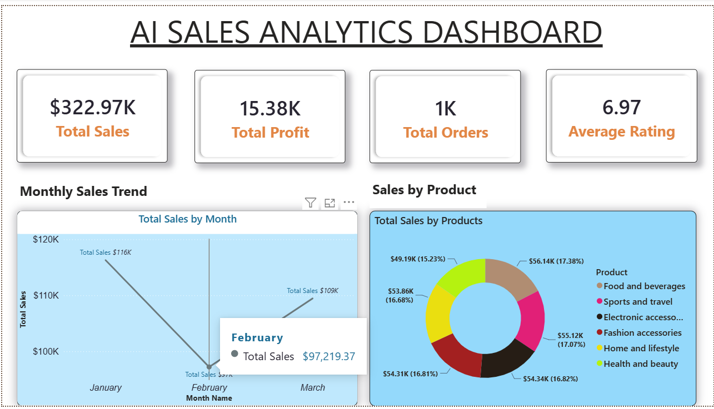
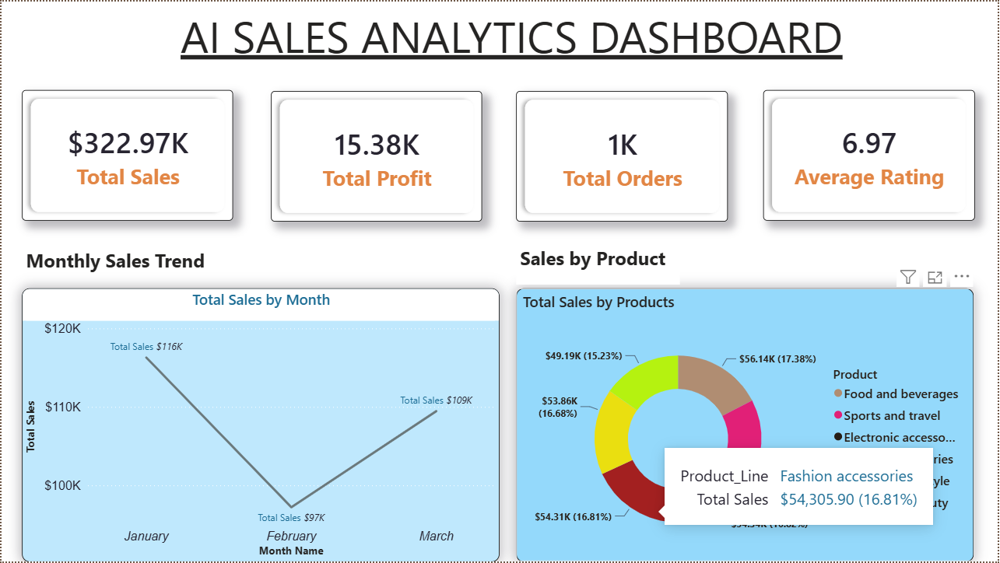
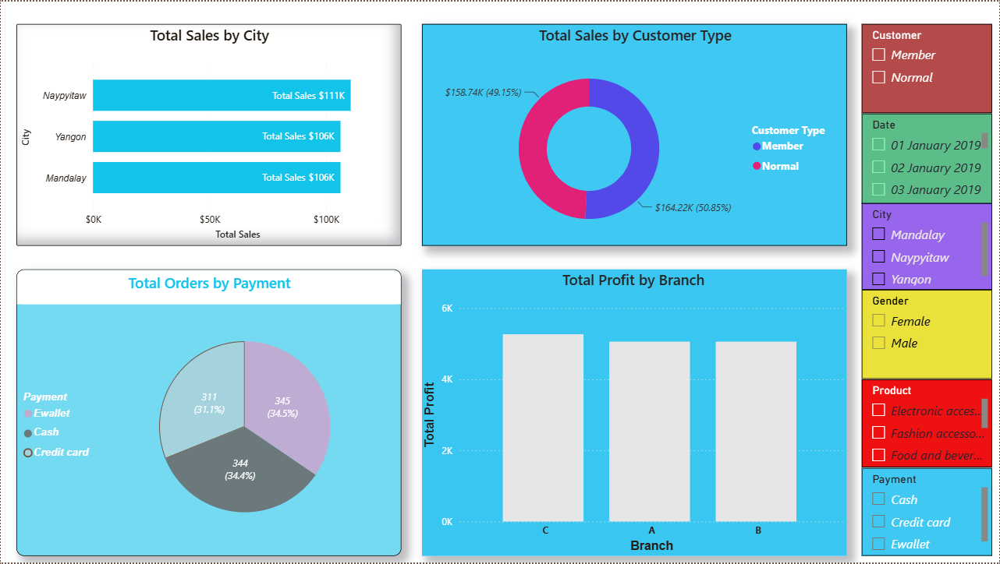
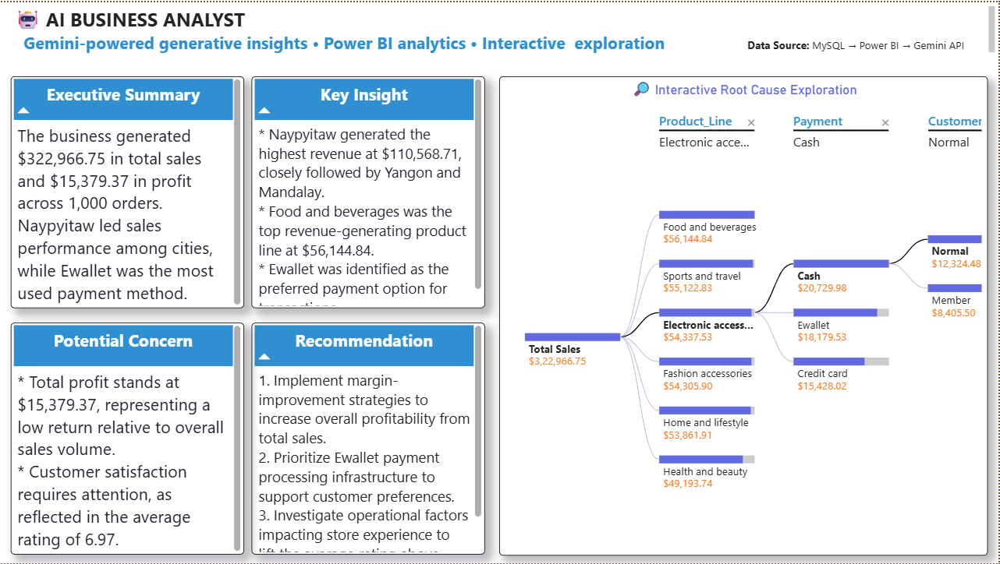

# 🤖 AI Sales Analytics Dashboard

An interactive AI-powered sales analytics dashboard built using Power BI, MySQL and Google Gemini API.

The project combines traditional business intelligence with generative AI to provide executive-level sales analysis, KPI monitoring, root-cause exploration and automated business recommendations.

---

## 📊 Project Overview

This dashboard analyzes supermarket sales data and transforms raw transactional data into interactive business insights.

The dashboard contains three main pages:

### 1. Sales Analytics Dashboard

Provides an executive overview of sales performance through:

- Total Sales
- Total Profit
- Total Orders
- Average Customer Rating
- Monthly Sales Trend
- Sales by Product Line
- Sales by City
- Sales by Customer Type
- Profit by Branch
- Orders by Payment Method
- Interactive filters

### 2. Detailed Sales Analysis

Provides deeper exploration of:

- City-level performance
- Customer segmentation
- Product performance
- Payment methods
- Branch profitability
- Gender analysis
- Date filtering
- Product filtering

### 3. AI Business Analyst

Uses Google Gemini API to generate AI-assisted business insights from the Power BI dataset.

The AI analysis provides:

- Executive Summary
- Key Business Insights
- Potential Concerns
- Business Recommendations
- AI-assisted root-cause exploration

---

## 🤖 AI Integration

Google Gemini API is integrated with Power BI using Power Query and REST API calls.

The workflow is:

MySQL / Dataset
        ↓
Power BI
        ↓
Power Query
        ↓
Gemini API
        ↓
AI-generated analysis
        ↓
Power BI Dashboard

The AI receives only the prepared business metrics and summarized dataset information required for analysis.

API credentials are kept private and are not included in this repository.

---

## 🛠️ Technologies Used

- Power BI
- Power Query
- DAX
- MySQL
- SQL
- Google Gemini API
- REST API
- Data Visualization
- Business Intelligence
- Generative AI

---

## 📈 Key Dashboard Features

### KPI Monitoring

- Total Sales
- Total Profit
- Total Orders
- Average Rating

### Business Analytics

- Monthly revenue trends
- Product-line performance
- City-level sales
- Customer segmentation
- Branch profitability
- Payment analysis

### AI Analytics

- Automated executive summary
- Key insight generation
- Potential business concerns
- AI-generated recommendations
- Root-cause exploration

---

## 🧠 Business Insights

The dashboard identifies patterns such as:

- Revenue distribution across cities
- Product-line performance
- Customer-type contribution
- Payment-method preferences
- Branch-level profitability
- Potential profitability improvement opportunities

---

## 📸 Dashboard Preview

### Sales Analytics

### Detailed Analysis

### AI Business Analyst

---

## 📄 Project Documentation

A PDF version of the complete Power BI dashboard is included:

[View / Download Dashboard PDF](AI-Sales-Analytics-Dashboard.pdf)

---

## 🎯 Skills Demonstrated

This project demonstrates practical experience with:

- Data cleaning and transformation
- Power Query
- DAX measures
- Data modeling
- KPI development
- Interactive dashboard design
- Business intelligence
- SQL/MySQL data analysis
- REST API integration
- Generative AI integration
- AI-assisted business analysis
- Data storytelling

---

## 👨‍💻 Author

Pranjal Mishra

MERN Stack Developer | SQL | Azure | Power BI | Generative AI

